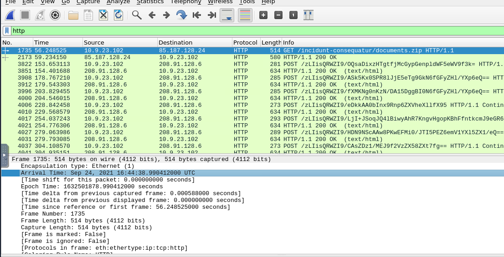
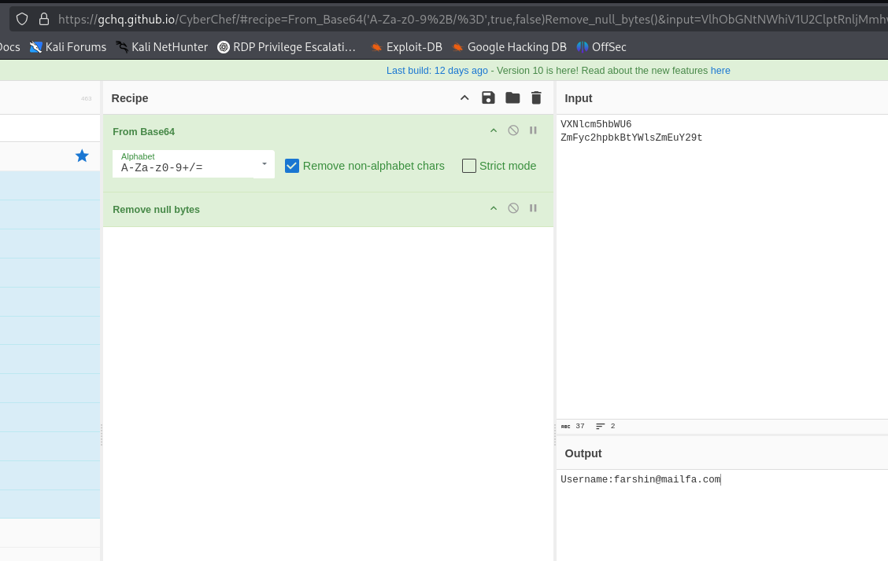

# TryHackMe: Carnage Challenge  

**Room URL:** [https://tryhackme.com/room/c2carnage](https://tryhackme.com/room/c2carnage)

---

## 🧠 Scenario

Eric Fischer from the Purchasing Department at Bartell Ltd received a phishing email with a malicious Word document. After clicking **"Enable Content"**, the endpoint agent detected suspicious outbound connections. The network sensor captured a PCAP, which you have been assigned to analyze.

---

## 🔍 Analysis & Questions

### Q1: What was the date and time for the first HTTP connection to the malicious IP?  
**Answer:** `2021-09-24 16:44:38`  
> Filtering for HTTP traffic quickly reveals the timestamp of the first connection.  

---

### Q2: What is the name of the zip file that was downloaded?  
**Answer:** `documents.zip`  
> Check the HTTP GET request to see the filename in the URL path.  
  
**Domain involved:** `attirenepal.com`

---

### Q3: What was the domain hosting the malicious zip file?  
**Answer:** `attirenepal.com`  

---

### Q4: Without downloading the file, what is the name of the file inside the zip?  
**Answer:** `chart-1530076591.xls`  
> Follow the stream of the file. After the ZIP magic number (`PK...`), you’ll spot the embedded filename.  

---

### Q5: What is the name of the webserver hosting the malicious file?  
**Answer:** `LiteSpeed`  
> Found in the HTTP response headers.  

---

### Q6: What is the version of the webserver?  
**Answer:** `PHP/7.2.34`  
> Retrieved from the same response headers.  

---

### Q7: Malicious files were downloaded from multiple domains. What are the three involved domains?  
**Answer:**  
- `finejewels.com.au`  
- `thietbiagt.com`  
- `new.americold.com`  
> Verified via VirusTotal — all are flagged as malicious.  
  

---

### Q8: Which certificate authority issued the SSL certificate for `finejewels.com.au`?  
**Answer:** `GoDaddy`  
> Found by filtering `tls.handshake.extensions_server_name == finejewels.com.au` and following the TCP stream.  

---

### Q9: What are the two IP addresses of the Cobalt Strike servers?  
**Answer:** `185.106.96.158, 185.125.204.174`  
> Identified by suspicious traffic patterns and confirmed via VirusTotal.  
  

---

### Q10: What is the Host header for the first Cobalt Strike IP?  
**Answer:** `ocsp.verisign.com`  
> Extracted from HTTP headers.  

---

### Q11: What is the domain name for the first Cobalt Strike IP?  
**Answer:** `survmeter.live`  
> Identified via VirusTotal lookup.  

---

### Q12: What is the domain name for the second Cobalt Strike IP?  
**Answer:** `securitybusinpuff.com`  

---

### Q13: What is the domain for post-infection traffic?  
**Answer:** `maldivehost.net`  

---

### Q14: What are the first eleven characters the victim sent to the malicious domain?  
**Answer:** `zLIisQRWZI9`  
> Found by following TCP stream of the traffic to `maldivehost.net`.  

---

### Q15: What was the length of the first packet sent to the C2 server?  
**Answer:** `281`  
> Filter by `http.host == "maldivehost.net"` and examine packet length.  

---

### Q16: What was the Server header for the malicious domain?  
**Answer:** `Apache/2.4.49 (cPanel) OpenSSL/1.1.1l mod_bwlimited/1.4`  

---

### Q17: When did the DNS query for the IP-checking API occur?  
**Answer:** `2021-09-24 17:00:04` UTC  
> Look for domains like `api.ipify.org` in DNS queries.  

---

### Q18: What was the domain used for the IP-check?  
**Answer:** `api.ipify.org`

---

### Q19: What was the first MAIL FROM address observed?  
**Answer:** `farshin@mailfa.com`  
> Use `smtp` filter and follow the SMTP stream.  
  

---

### Q20: How many packets were observed in the SMTP traffic?  
**Answer:** `1439`  
> Apply the `smtp` filter and count the packets.  

