# TryHackMe: Masterminds Challenge  

**Room URL:** [https://tryhackme.com/room/mastermindsxlq](https://tryhackme.com/room/mastermindsxlq)

---

## 🧠 Scenario

Three machines in the Finance department at Pfeffer PLC were compromised. We suspect the initial source of the compromise happened through a phishing attempt and by an infected USB drive. The Incident Response team managed to pull the network traffic logs from the endpoints. Use Brim to investigate the network traffic for any indicators of an attack and determine who stands behind the attacks. 

---

## 🔍 Analysis & Questions

---

## [Infection 1]

>so at first i was just looking at the software , i thought that i might find something like on the files but nop didnt even find a file just a hash i run one through virus total

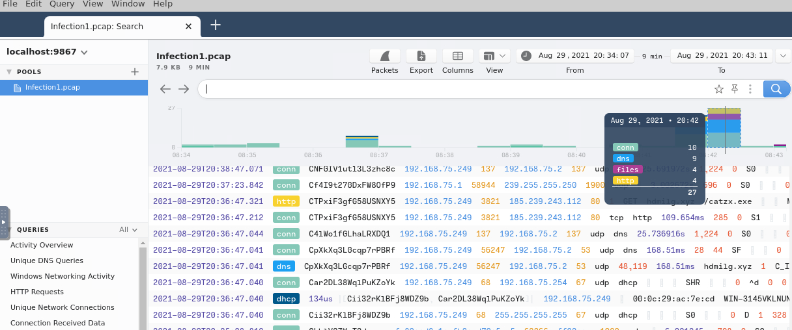

---

### Q1: Provide the victim's IP address.
**Answer:** `192.168.75.249`

> By Going Down i found a event_type : Alert it said a trojan was detected so clearly it.    

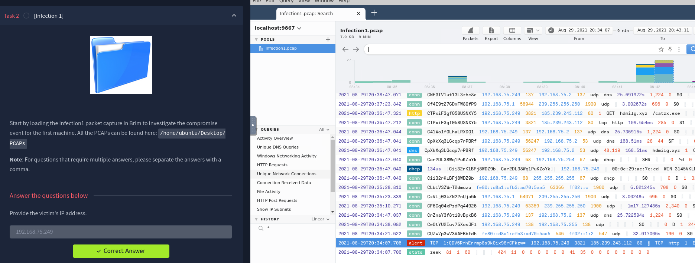

---

### Q2: The victim attempted to make HTTP connections to two suspicious domains with the status '404 Not Found'. Provide the hosts/domains requested. 
**Answer:** `cambiasuhistoria.growlab.es ,www.letscompareonline.com`

> By filterting by http we found the 404 packet

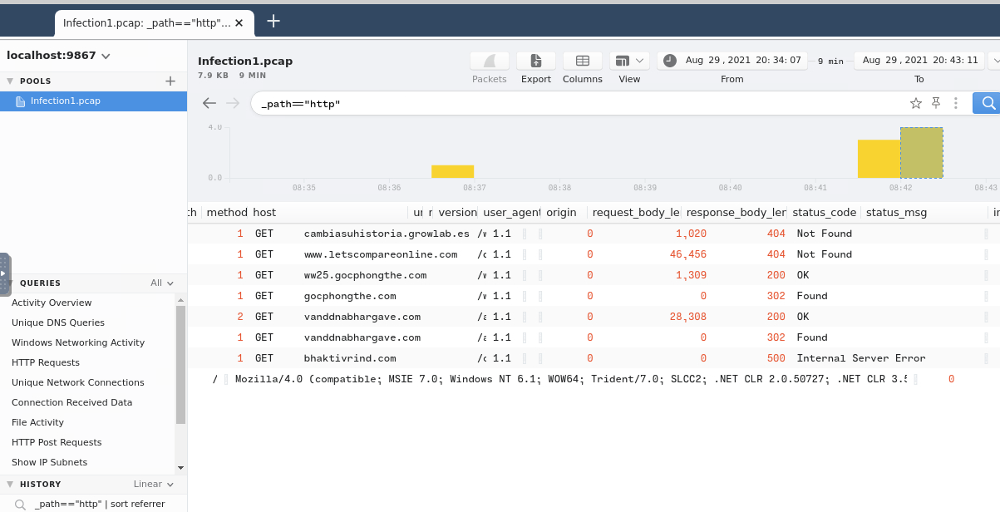

---

### Q3: The victim made a successful HTTP connection to one of the domains and received the response_body_len of 1,309 (uncompressed content size of the data transferred from the server). Provide the domain and the destination IP address.
**Answer:** `ww25.gocphongthe.com,199.59.242.153`

> Same we are still on the filtering by http , and only one packet with that description of `1309` length

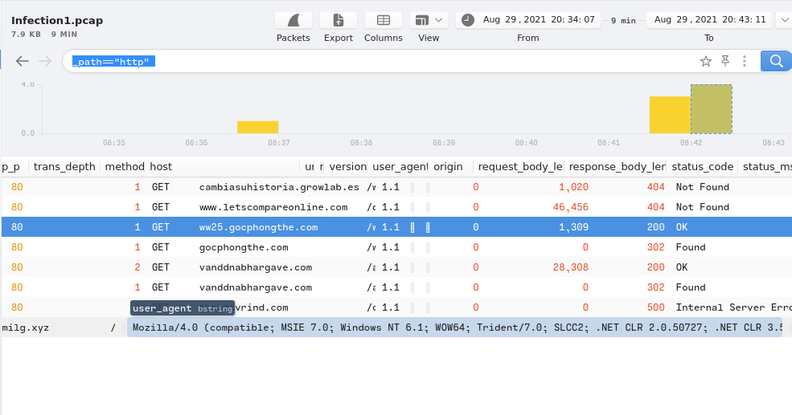

> And the Response

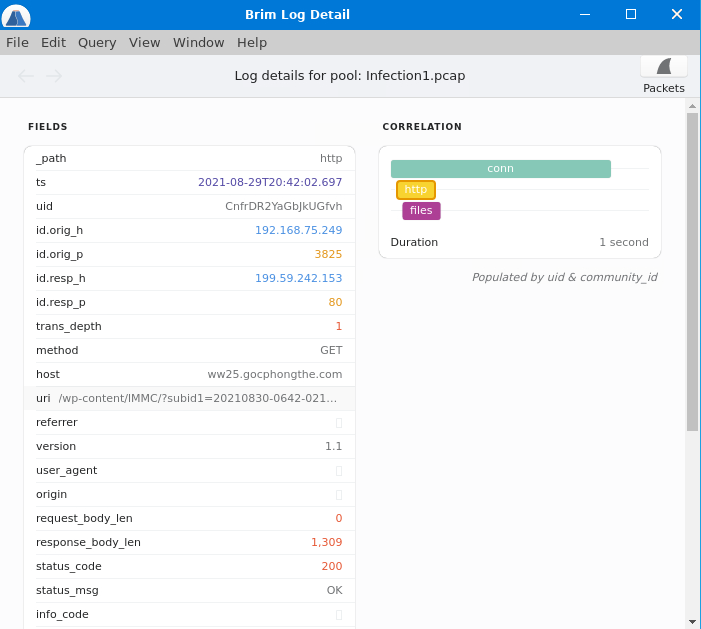

---

### Q4: How many unique DNS requests were made to cab[.]myfkn[.]com domain (including the capitalized domain)? 
**Answer:** `7`

>by filtering and adding both query we find how many time's

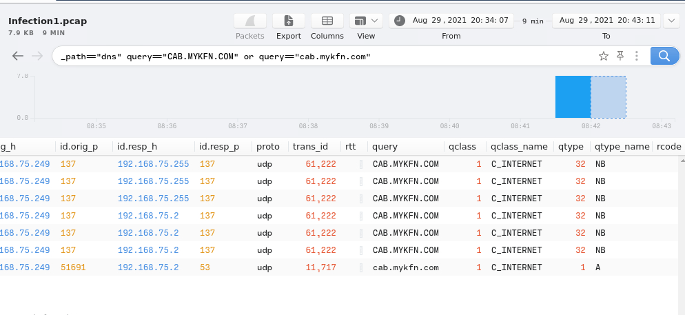

---

### Q5: Provide the URI of the domain bhaktivrind[.]com that the victim reached out over HTTP. 
**Answer:** `/cgi-bin/JBbb8/`

> Goed back to where the dns was made and was searching right after it for what the connection and find it a http request with the host bhaktivrind[.]com

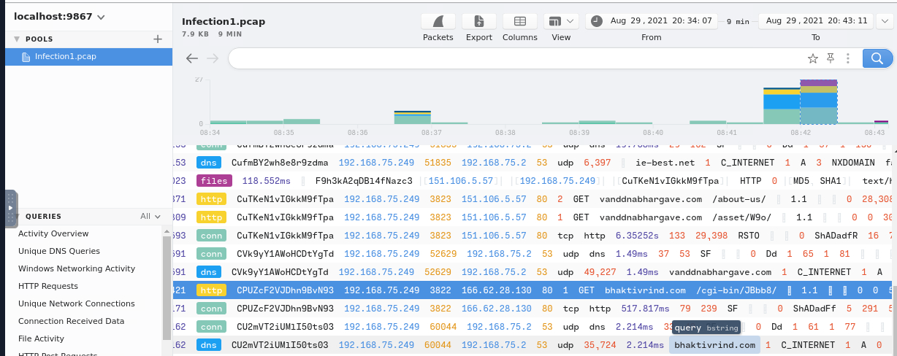

---

### Q6: Provide the IP address of the malicious server and the executable that the victim downloaded from the server.
**Answer:** `185.239.243.112,catzx.exe`

> It was actualy the first thing i found but kept it apart as i was searching for file's downloaded. 

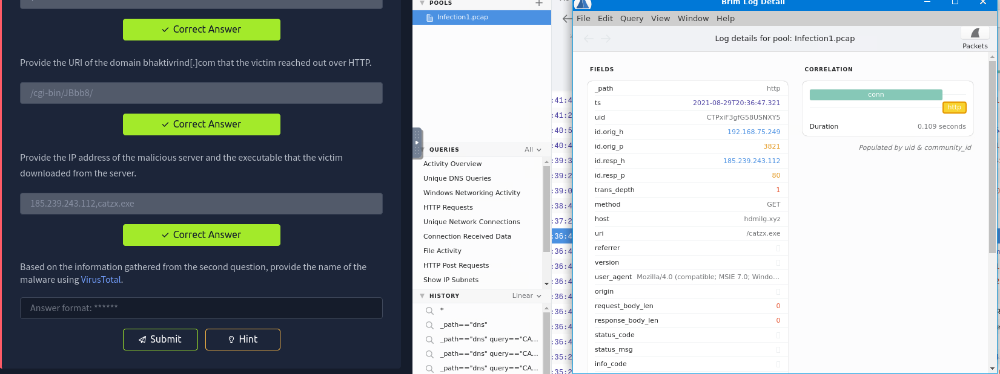

---

### Q7: Based on the information gathered from the second question, provide the name of the malware using VirusTotal. 
**Answer:** `Emotet`

> The name Emotet kept repeating so i searched and found it's a malware who use phishing attacks

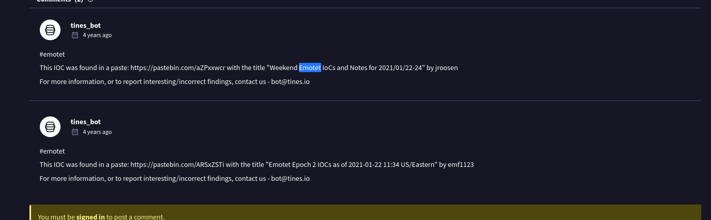 

## [Infection 2]

### Q1: Provide the IP address of the victim machine. 
**Answer:** `192.168.75.146`

> The Alert was about a dll exucuting ( trojan ) 

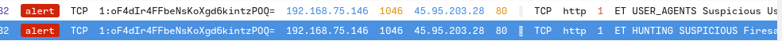

---

### Q2: Provide the IP address the victim made the POST connections to. 
**Answer:** `5.181.156.252`

> We See a yellow allert that a http connection was trying to be made we follow and we got on the event_type http with a post to that ip 

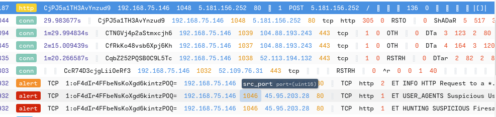

---

### Q3: How many POST connections were made to the IP address in the previous question?
**Answer:** `3`

> Well just have to filter with http as not so much http traffic

---

### Q4: Provide the domain where the binary was downloaded from. 
**Answer:** `hypercustom.top`

- `/jollion/apines.exe`
> Well it's a Get Request 

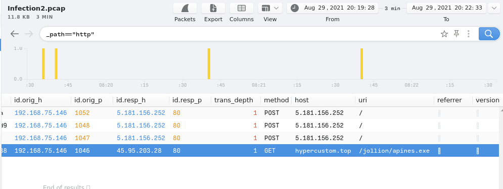

---

### Q5: Provide the name of the binary including the full URI. 
**Answer:** `/jollion/apines.exe`

> same as previous image you search the uri

---

### Q6: Provide the IP address of the domain that hosts the binary.
**Answer:** `45.95.203.28`

> Same Id_Respond_ip

---

### Q7: There were 2 Suricata "A Network Trojan was detected" alerts. What were the source and destination IP addresses?  
**Answer:** `192.168.75.146,45.95.203.28`

> So filter by alert and both the trojan are the red one and you can find the tab `Alert.category` you will find there if it's a trojan or something else

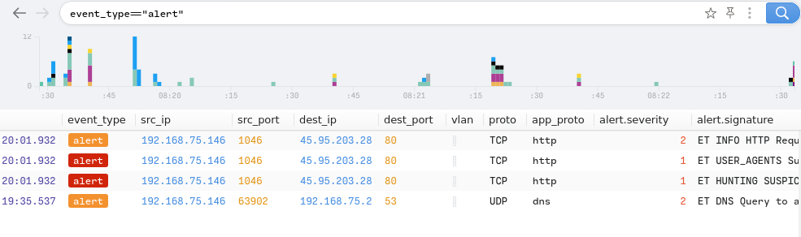

---

### Q8: Taking a look at .top domain in HTTP requests, provide the name of the stealer (Trojan that gathers information from a system) involved in this packet capture using URLhaus Database. 
**Answer:** `Redline Stealer`

> So at first i didn't see it said <domain>.top so i looked for awnser and found the same malicious ip `45.95.203.28` so i was sure it's that 

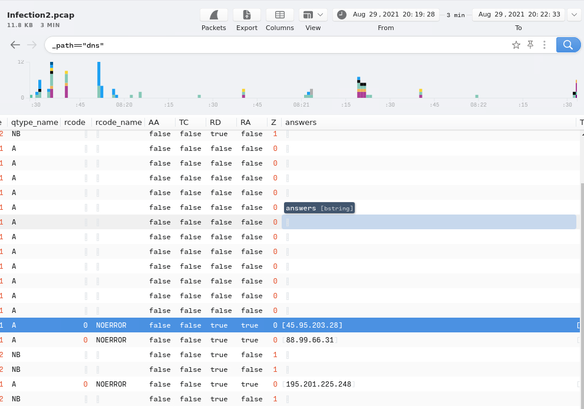

> and here you find the malware tag 

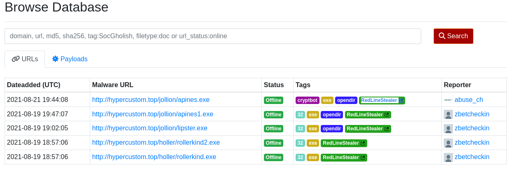

---

## [Infection 3]

### Q1: Provide the IP address of the victim machine.
**Answer:** `192.168.75.232`

> 

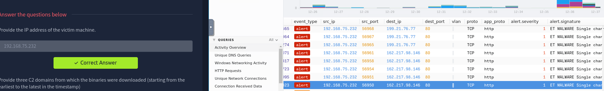

---

### Q2: Provide three C2 domains from which the binaries were downloaded (starting from the earliest to the latest in the timestamp) 
**Answer:** `efhoahegue.ru,afhoahegue.ru,xfhoahegue.ru`

> So we go to where the alert was first detected and you see 3 http request and get of 3 .exe file 

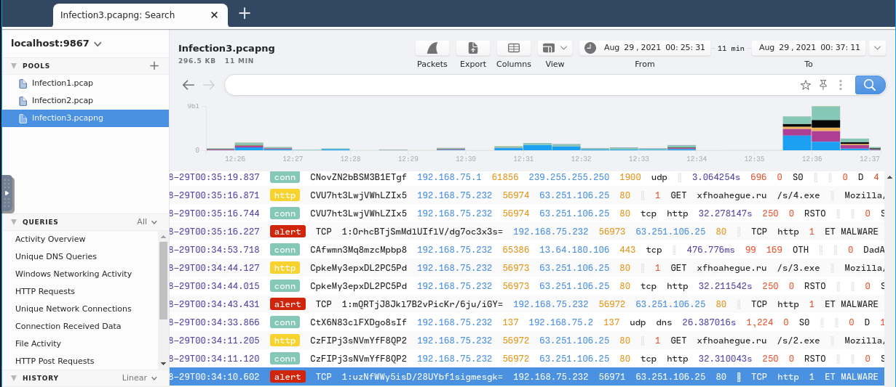

> and to make it even easier filter by http

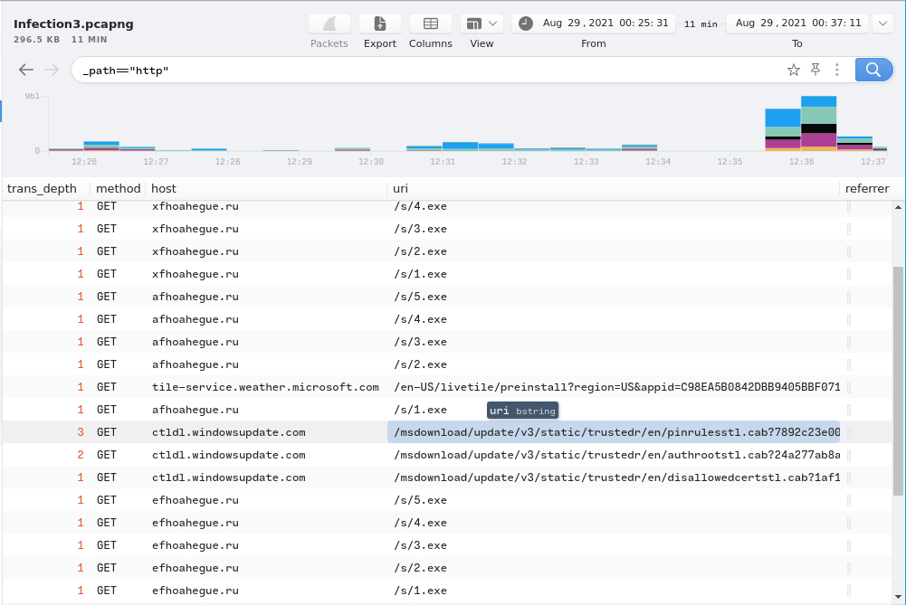

---

### Q3: Provide the IP addresses for all three domains in the previous question.
**Answer:** `162.217.98.146,199.21.76.77,63.251.106.25`

> Same As before 

---

### Q4: How many unique DNS queries were made to the domain associated from the first IP address from the previous answer?  
**Answer:** `2`

> we filter by `dns` and the domain `efhoahegue.ru` 

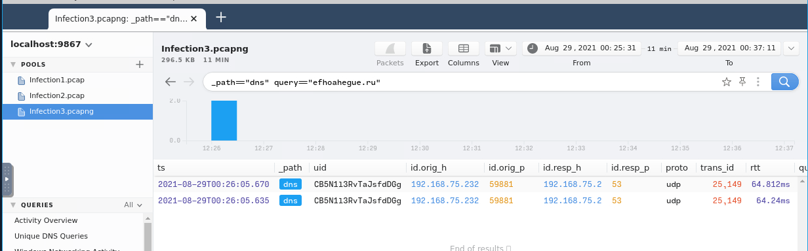

---

### Q5: How many binaries were downloaded from the above domain in total?  
**Answer:** `5`

> so we take by name's and `/s/1.exe` ,`/s/2.exe` ,`/s/3.exe` ,`/s/4.exe`, `/s/5.exe`

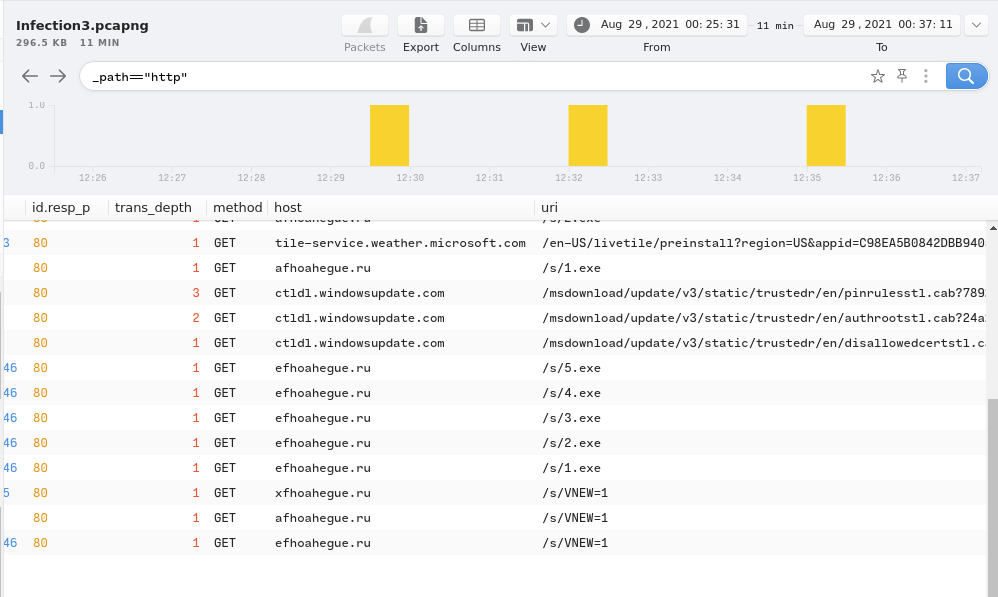

---

### Q6: Provided the user-agent listed to download the binaries.  
**Answer:** `Mozilla/5.0 (Macintosh; Intel Mac OS X 10.9; rv:25.0) Gecko/20100101 Firefox/25.0`

> You enter one of the /s/x.exe and search the user-agent tab

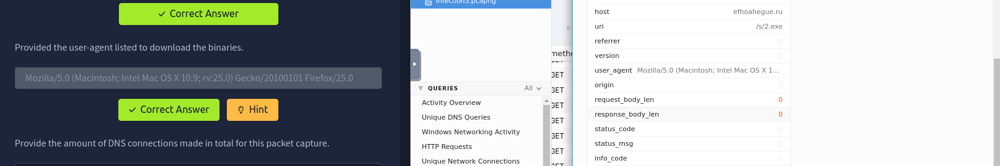
---

### Q7: Provide the amount of DNS connections made in total for this packet capture. 
**Answer:** `986`

> as simple as it is just use the `count()`

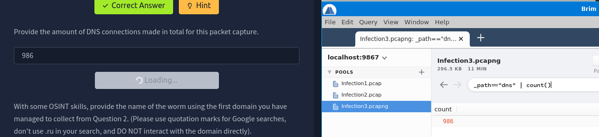

---

### Q8: With some OSINT skills, provide the name of the worm using the first domain you have managed to collect from Question 2. (Please use quotation marks for Google searches, don't use .ru in your search, and DO NOT interact with the domain directly). 
**Answer:** `Phorphiex`

> so by searching ` ` i found this [https://tria.ge/201105-yhb3bs35rs/behavioral2](https://tria.ge/201105-yhb3bs35rs/behavioral2) 

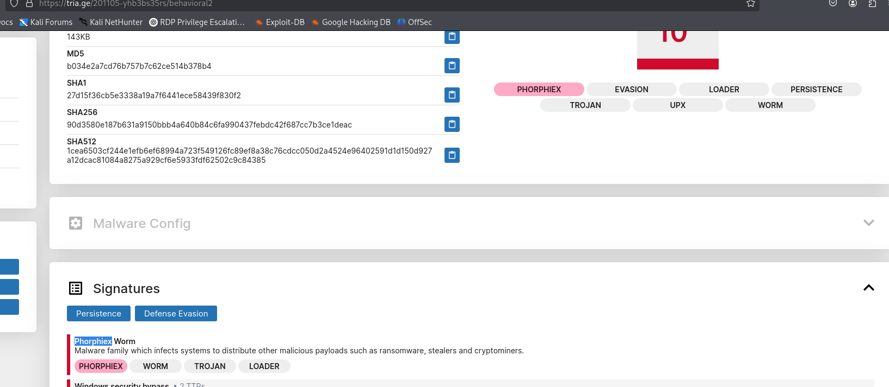